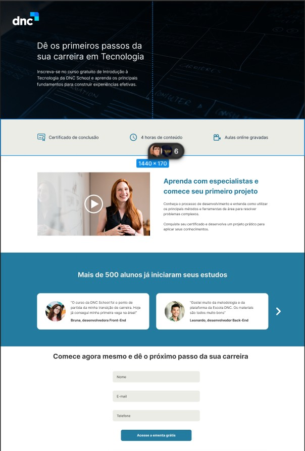

# Projeto Landing Page - Escola DNC

Este é o projeto de desenvolvimento de uma Landing Page, criado como parte do curso "Introdução ao Desenvolvimento Web" da Escola DNC.

## 📖 Sobre o Projeto

O objetivo principal foi replicar um layout fornecido através de um protótipo no Figma, aplicando conceitos fundamentais de HTML e CSS para construir uma página web estática e responsiva.

O design original pode ser visualizado no Figma através [deste link](https://www.figma.com/design/ZpH9zHhUABIpLwli1Xp3z3/-TECH--Case-Mentorias---Landing-Page-DNC-School?node-id=1227-37&t=EmCnOv59ycNKrk8o-0).

## 💻 Tecnologias Utilizadas

O projeto foi desenvolvido utilizando as seguintes tecnologias:

- **HTML5:** Para a estruturação e semântica do conteúdo.
- **CSS3:** Para a estilização, layout e design da página.
- **Figma:** Como ferramenta de prototipação e guia de design.

## 🚀 Como Visualizar o Projeto

Como é um projeto front-end estático, você não precisa de um servidor. Basta seguir os passos:

1.  Faça o download ou clone este repositório.
2.  Abra o arquivo `index.html` no seu navegador de preferência (Google Chrome, Firefox, etc.).

## ✨ Layout

Abaixo está uma prévia do resultado final da landing page. Para adicionar a sua imagem, tire um "print" da página e salve o arquivo na pasta do projeto.

## ✒️ Autor

Desenvolvido por **Vinicius Matos de Mendonça**.
